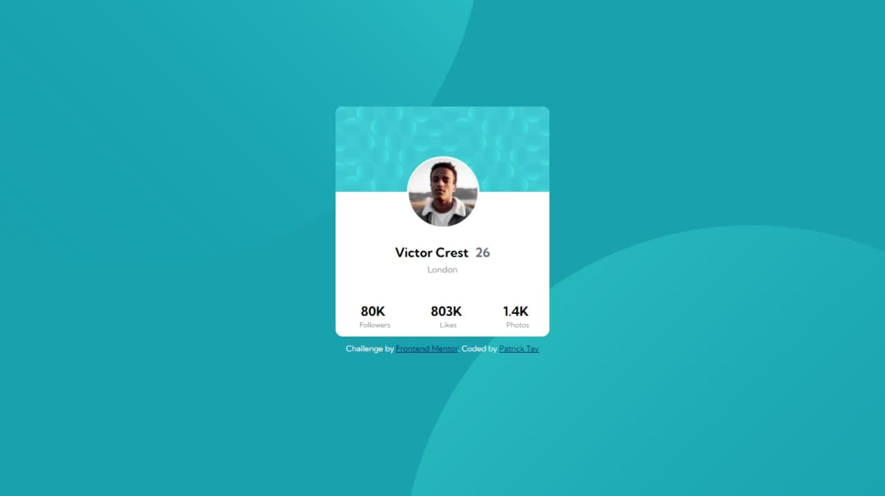

# Frontend Mentor - solução de componente de cartão de perfil

Esta é uma solução para o desafio do componente do cartão de perfil no Frontend Mentor (https://www.front//or.io/challenges/profile-card-component-cfArpWshJ). Os desafios do Frontend Mentor ajudam você a melhorar suas habilidades de codificação ao construir projetos realistas.

## Visão geral

### O desafio

- O desafio posto foi uma visualização de um componente de perfil de rede social com curtidas, seguidores e fotos. Com uma foto de perfil e cores de funo.

### Screenshot

### Links

- URL do site ativo:(https://painel-de-perfil-social.vercel.app/)

## Meu processo
   Meu Processo de evolução e conhecimento foi abrangido após este desafio pois tive um desafio comigo mesmo para chegar à esse resultado, ou o mais perto possivel do ideal.

### Construído com

- Semantic HTML5 markup
- CSS custom properties
- Flexbox
- Mobile-first workflow

### What I learned

### O que eu aprendi

  Tomo como conhecimento todo o meu aprendizado para abrir minha mente para mais conhecimeto, pois aprendi que devo sempre aprender mais e alem de aprender, executar.

### Desenvolvimento contínuo

  Estou na busca do meu desenvolvimento continuo e posso adiantar que apartir deste desafio, estudar mais sobre bootstrap.

## Author

- Frontend Mentor - [@PatrickTav](https://github.com/PatrickTav)

